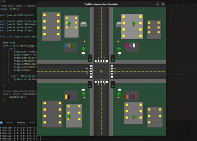

# JRaffic - Traffic Intersection Simulator

A JavaFX-based traffic intersection simulator that demonstrates intelligent traffic flow management and intersection control algorithms.

## 🚦 Overview

JRaffic simulates a four-way traffic intersection with realistic traffic light controls, car movement, and collision detection. The system manages traffic flow using priority-based algorithms and visual feedback through dynamic traffic lights.

## ✨ Features

- **Real-time Traffic Simulation**: Watch cars move through a realistic intersection
- **Intelligent Traffic Control**: Priority-based intersection management
- **Dynamic Traffic Lights**: Visual feedback with red/green light states
- **Interactive Car Spawning**: Use arrow keys to create cars from different directions
- **Collision Detection**: Cars maintain safe distances and stop at intersections
- **Right-of-Way Logic**: Implements realistic traffic rules (right turns have priority)
- **Multi-lane Support**: Separate lanes for each direction (Up, Down, Left, Right)

## 🎮 Controls

- **↑ Arrow Key**: Spawn car moving UP
- **↓ Arrow Key**: Spawn car moving DOWN
- **← Arrow Key**: Spawn car moving LEFT
- **→ Arrow Key**: Spawn car moving RIGHT

## 🎯 Demo

### Video Demonstration


*Watch the simulation in action - cars intelligently navigate through the intersection with proper traffic light coordination*

## 🏗️ Project Structure

```
jraffic/
├── demo.gif                     # Demo video of the simulation
├── jraffic/                     # Main project directory
│   ├── pom.xml                  # Maven configuration
│   └── src/main/
│       ├── java/
│       │   ├── jraffic/
│       │   │   ├── App.java                    # Main application entry point
│       │   │   ├── RoadController.java         # JavaFX controller for UI
│       │   │   ├── helpers/
│       │   │   │   ├── Constants.java          # Application constants
│       │   │   │   ├── Direction.java          # Direction enumeration (Up/Down/Left/Right)
│       │   │   │   └── Towards.java            # Turn direction enumeration (Forward/Left/Right)
│       │   │   └── service/
│       │   │       ├── Car.java                # Car entity and movement logic
│       │   │       └── Traffic.java            # Main traffic management with TrafficHelper
│       │   └── module-info.java               # Java module configuration
│       └── resources/jraffic/
│           ├── car_24px_blue_*.png            # Blue car sprites (4 directions)
│           ├── car_24px_green_*.png           # Green car sprites (4 directions)
│           ├── car_24px_yellow_*.png          # Yellow car sprites (4 directions)
│           └── road.fxml                      # UI layout definition
├── readme_maven_javafx.md       # Maven/JavaFX setup guide
└── README.md                    # This file
```

## 🚀 Getting Started

### Prerequisites

- Java 11 or higher
- JavaFX 11 or higher
- Maven (for dependency management)

### Installation

1. **Clone the repository**
   ```bash
   git clone https://github.com/yourusername/jraffic.git
   cd jraffic
   ```

2. **Navigate to project directory**
   ```bash
   cd jraffic
   ```

3. **Build the project**
   ```bash
   mvn clean compile
   ```

4. **Run the application**
   ```bash
   mvn javafx:run
   ```

### Alternative Setup

If you're using an IDE like IntelliJ IDEA or Eclipse:

1. Import the project as a Maven project
2. Ensure JavaFX is properly configured
3. Run the main application class

## 🧠 Algorithm Details

### Traffic Management
- **Priority System**: First-come-first-served basis using car IDs
- **Right-of-Way Rules**: Right turns have priority over other movements
- **Opposite Direction Logic**: Cars from opposite directions can move simultaneously
- **Safe Distance**: Cars maintain minimum safe distance from each other

### Intersection States
1. **Approaching**: Cars detect intersection and prepare to stop
2. **Stopped**: Cars wait at the intersection for their turn
3. **Inside**: Cars are actively crossing the intersection
4. **Outside**: Cars have exited and continue on their path

### Traffic Light Logic
- **Red Light**: Active when cars must stop at intersection
- **Green Light**: Active when cars from that direction are in intersection
- **Dark State**: Lights are off when no traffic activity

## 🎨 Car Sprites

The simulation features colorful car sprites in three different colors:
- **Blue Cars**: `car_24px_blue_1.png` to `car_24px_blue_4.png`
- **Green Cars**: `car_24px_green_1.png` to `car_24px_green_4.png` 
- **Yellow Cars**: `car_24px_yellow_1.png` to `car_24px_yellow_4.png`

Each color set includes 4 directional sprites for realistic car orientation as they move through the intersection.

## 🔧 Configuration

Key constants can be modified in `Constants.java`:

- `MAXCARS`: Maximum cars per lane
- `SAFEDISTANCE`: Minimum distance between cars
- `CARSIZE`: Size of car sprites
- `SPEED`: Car movement speed
- `ROAD_HEIGHT`: Intersection dimensions
- `WINDOW_HEIGHT`: Application window size

## 🎨 Customization

### Adding New Features
- **Traffic Patterns**: Modify `getRandomTowards()` for different turning probabilities
- **Car Types**: Extend the `Car` class for different vehicle types
- **Road Layouts**: Adjust coordinates in FXML for different intersection designs
- **Traffic Rules**: Modify `checkIfCanMove()` for different traffic laws

### Visual Customization
- **Colors**: Update traffic light colors in the controller
- **Car Appearance**: Modify car shapes in the `Car` class
- **Road Design**: Edit the FXML file for different road layouts

## 🐛 Troubleshooting

### Debug Mode
The application outputs debug information to console:
```
Inside: 2 Outside: 5 T: 3 D: 2 R: 1 L: 4
```
This shows the number of cars in each state/direction.

## 🤝 Contributing

1. Fork the repository
2. Create a feature branch (`git checkout -b feature/amazing-feature`)
3. Commit your changes (`git commit -m 'Add amazing feature'`)
4. Push to the branch (`git push origin feature/amazing-feature`)
5. Open a Pull Request
ct is licensed under the MIT License - see the [LICENSE](LICENSE) file for details.


*Built with ❤️ using JavaFX*